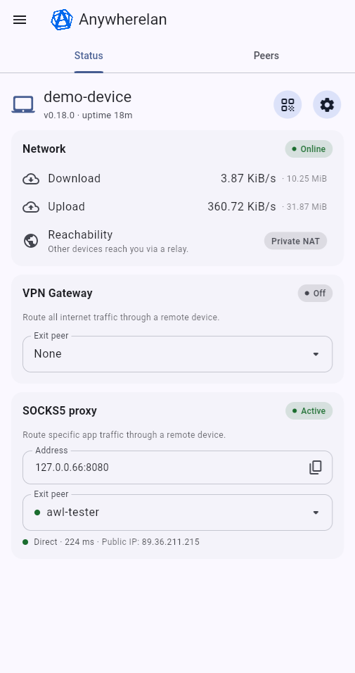
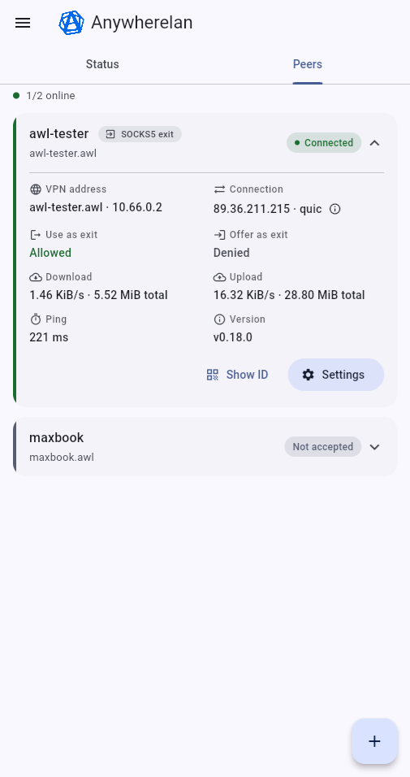

# Anywherelan (GUI)

The cross-platform GUI for the [Anywherelan](https://github.com/anywherelan/awl) peer-to-peer mesh VPN. All the networking lives in the Go backend in the [`awl`](https://github.com/anywherelan/awl) repo — this is only its frontend, written in Flutter.

Please report issues at the [anywherelan issue tracker](https://github.com/anywherelan/awl/issues).

## Features

- Fully peer-to-peer — no coordination server, traffic goes directly between your devices.
- Full-tunnel VPN gateway: route all of your traffic through a remote device (exit node).
- Route per-app traffic through a remote device as a SOCKS5 proxy.
- Automatic NAT traversal, with a fallback to community relays when a direct path isn't possible.
- TLS 1.3 encryption (QUIC or TCP+TLS).
- Add peers by scanning a QR code.

## Platforms

- **Android** — full client: the backend is embedded in the app, which owns the VPN interface and supports the VPN gateway and SOCKS5 proxy.
- **Web** — read-only / observation mode: connects to an already-running backend; it cannot start/stop the server or control the VPN.

## How it talks to the backend

The GUI never does networking itself — it drives the `awl` backend over its HTTP REST API:

- **Web** calls an already-running backend over HTTP. Since the browser request is cross-origin, the backend has to allow it via CORS (in local development a small proxy bridges the two).
- **Android** embeds the backend (a [gomobile](https://pkg.go.dev/golang.org/x/mobile) build of `awl`) and runs the same HTTP server locally, which the UI calls exactly like on web. A few things can't go over HTTP, though — starting the backend, owning the VPN interface, and reconfiguring routes for the gateway — so those use Android-specific platform channels (Kotlin) instead.

## Install

Grab the APK from the [releases page](https://github.com/anywherelan/awl/releases).

## Screenshots

<p>
  
  
</p>

## Building

```bash
flutter pub get
dart run build_runner build   # generate JSON serialization code
flutter run                   # run on a connected device/emulator
```

> **Android** also needs the Go backend built as `anywherelan.aar` from the sibling `../awl` repo (`./build.sh android-lib`); without it the app fails to start.

For the full build instructions (Go backend, Android library, release builds) see [BUILDING.md](https://github.com/anywherelan/awl/blob/master/BUILDING.md) in the `awl` repo.

## License

[MPLv2](LICENSE).
